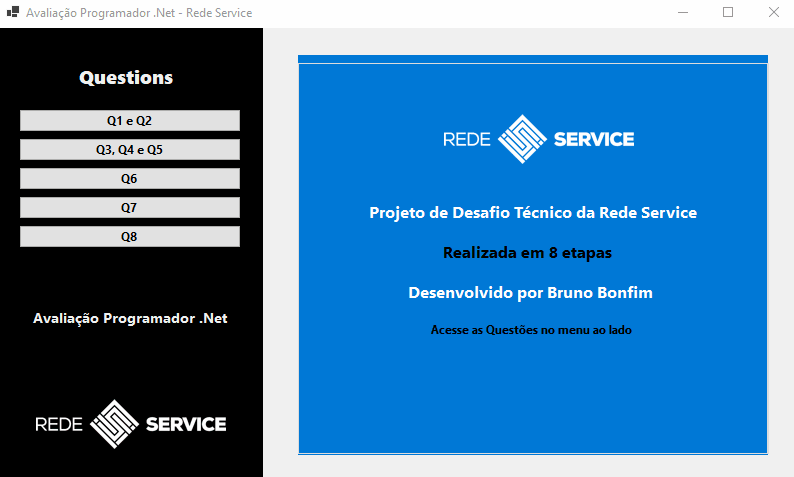

---

# Avaliação Programador .NET - Aplicação Windows Form

Bem-vindo à Avaliação do Programador .NET da Rede Service. Este projeto é uma aplicação Windows Form que aborda várias tarefas e conceitos essenciais do desenvolvimento em C# e .NET. Siga as instruções abaixo para configurar e executar a aplicação.

## Pré-requisitos

- Visual Studio 2022
- .NET 6

## Configuração

1. Abra o projeto no Visual Studio 2022.

2. Certifique-se de que todas as dependências necessárias estão instaladas, incluindo as bibliotecas mencionadas no código, como `ServiceReference1`, `Newtonsoft.Json`, e `System.Net`.

3. Certifique-se de estar usando o .NET 6.

## Funcionalidades

### 1. Ordenação de Números

- Permite a digitação de números e os exibe em tela de forma ordenada.

### 2. Gravação em Arquivo Texto

- Os números visualizados são gravados em um arquivo chamado `numeros_ordenar.txt` na pasta raiz da aplicação e também na pasta `bin`, conforme o projeto Release disponibilizado como exemplo a ser replicado.

### 3. Lista de Itens

- Cria uma lista contendo 100 itens da classe `clsTeste`, com propriedades `codigo` e `descricao`.

### 4. Gravação em Arquivo JSON

- A lista criada na etapa 3 é gravada em um arquivo chamado `data.json` na pasta raiz da aplicação e também na pasta `bin`, conforme o projeto Release disponibilizado como exemplo a ser replicado.

### 5. Exibição de Dados em Grid

- Lê o arquivo `data.json` e exibe os dados em um Grid criado na aplicação.

### 6. Consumo de Web Service dos Correios

- Adicionado referência de serviço `WCF Web Service` e usado `consultaCEPAsync` ao invés do Método: `consultaCEP`.

### 7. Consumo de API Bancária

- Fiz como exigido e segui o padrão da documentação:

  - `ispb` - string
  - `name` - string
  - `code` - integer `<int32>`
  - `fullName` - string

### 8. Download e Exibição de Imagem

- Faz o download da imagem [Rede Service Logo](https://redeservice.com.br/wp-content/uploads/2020/07/redeservice-logo.png) e a exibe em tela no formato base64. Além disso, foi acrescentado um quadro `PictureBox` para ver a imagem.

## Execução

1. Compile e execute o projeto no Visual Studio.

2. Utilize as diferentes funcionalidades da aplicação conforme descrito nas etapas acima.

## Notas Adicionais

- Este projeto segue as diretrizes do .NET 6 e foi criado com base nas bibliotecas e referências especificadas.

- Certifique-se de que a aplicação tenha acesso à internet para consumir serviços da web e fazer o download da imagem.

---
